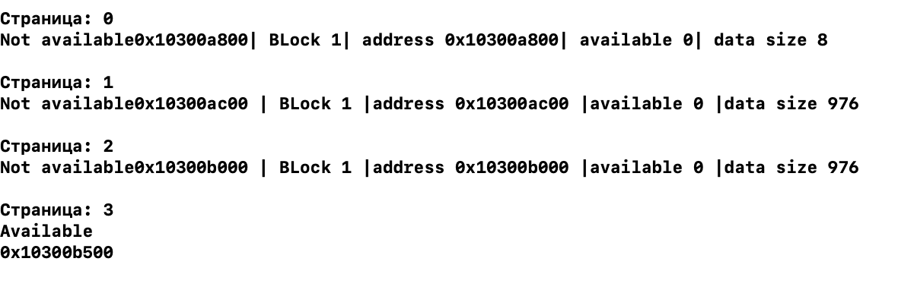

# Paging memory allocator

Аллокатор памяти общего назначения в виде страниц.

## Структура
Аллокатор работает на основе страниц(pages).
Страница может быть заполнена блоками или быть пустой. 
Блок памяти может занимать несколько страниц. 

Блок памяти состоит из хедера и самого блока памяти. 
Хедер занимает 5 байта, 1 байт это информация про состояние блока свободен/занят, остальные 4 байта это размер блока.

Страница(page) имеет свойства:
- колличество свободных блоков
- Адресс первого свободного блока памяти.
- Свободна/занята.

## Функции аллокатора
Изначально создаются 12 страниц, у каждой страницы заполнены первоначальные свойства.(Все страницы свободны)

Функция allocation(size_t size) выделяет память которую мы передаем в size как параметр. 
Если size меньше половины страницы:
Мы находим страницу с подходящими по размеру свободными блоками, заполняем хедер блока памяти такими параметрами: isAvailable - false, data size. В свойствах страницы меняем параметры: topBlock на указатель нового блока, quantity - минус один.
В ином случае, мы находим первую доступную страницу без блоков. isAvailable страницы меняем на false. Рассчитываем колличество блоков которые будут помещаться на этой страницу учитывая размер выделяемого блока памяти. 

Если size от половины страницы до размера страницы:
В таком случае мы выделяем полную страницу, isAvailable - false, quantity = 0 (колл-во доступных свободных блоков страницы).

Если size больше чем размер одной страницы мы выделяем несколько страниц. 

Функция free(void* pointer) освобождает блок памяти по переданному указателю. 

Функция reallocation(void* pointer, size_t size) меняет размер блока памяти на новый размер. 

### Результат

Several blocks 

Free memory

